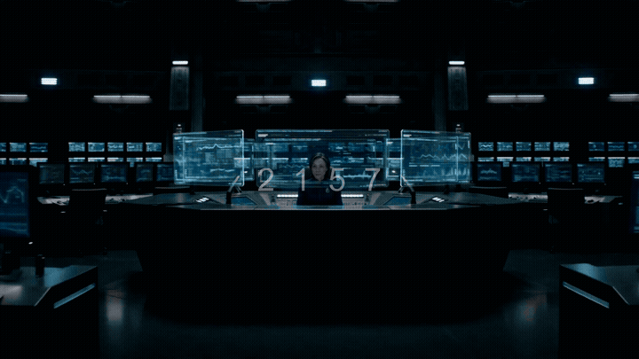

<p align="center">
  
</p>

<h1 align="center">StoryMind</h1>

<p align="center"><strong>AI Storyboard Director — From Story to Screen</strong></p>

<p align="center">
  Tell StoryMind what film you want to make. It plans every shot like a professional director,
  generates each scene with AI, and assembles the final video automatically.
</p>

<p align="center">
  <a href="#quick-start">Quick Start</a> &nbsp;·&nbsp;
  <a href="#how-it-works">How It Works</a> &nbsp;·&nbsp;
  <a href="#pipelines">Pipelines</a> &nbsp;·&nbsp;
  <a href="#providers">Providers</a> &nbsp;·&nbsp;
  <a href="AGENT_GUIDE.md">Agent Guide</a>
</p>

<p align="center">
  <a href="LICENSE"></a>
  
  
  
</p>

---

## Demo

<p align="center">
  <a href="https://github.com/LinHao-city/StoryMind/releases/download/v1.0/last_signal_v2_final.mp4">
    
  </a>
</p>

> **▶ ["THE LAST SIGNAL"](https://github.com/LinHao-city/StoryMind/releases/download/v1.0/last_signal_v2_final.mp4)** — 30-second cinematic sci-fi short, fully produced by StoryMind.  
> A lone astrophysicist in 2157 decodes an alien signal — a three-million-year-old farewell from a dead civilization.  
> **Shot plan:** Claude LLM (6 shots: WS→ECU→MCU→LS→CU→EWS, character anchors injected)  
> **Video:** Doubao Seedance 2.0 · **Voice:** Piper TTS · **Music:** Pixabay "Space Ambient" · **Compose:** FFmpeg  
> *Click the preview to download and watch the full video.*

---

## What Is StoryMind?

Most AI video tools take a prompt and return a clip. StoryMind works the way a real film production does — it thinks before it shoots.

**The core idea:** before generating a single frame, StoryMind runs an LLM-powered **Storyboard Director** that breaks your script into a structured shot-by-shot plan. Each shot gets a specific scale (close-up, wide, aerial), a camera movement (dolly-in, crane, handheld), a lighting design, and exact character descriptions that carry through every scene. Only then does video generation begin — with prompts that actually communicate cinematography.

```
Your prompt: "A scientist decodes an alien farewell signal from 3 million years ago"
     ↓
StoryboardPlanner (Claude):
  Shot 1 — WS · static · cold-blue lab, scientist silhouetted at console
  Shot 2 — ECU · dolly-in · her eyes reflecting cascading alien symbols
  Shot 3 — MCU · handheld · hands manipulating holographic equations
  Shot 4 — LS · slow pull-back · figure alone in vast dark control room
  Shot 5 — CU · static · single tear, expression shifting to acceptance
  Shot 6 — EWS · crane-up · starfield, distant nebula, silence
     ↓
Doubao Seedance generates each shot with the exact cinematography prompt
     ↓
FFmpeg assembles, mixes narration + music, burns titles
     ↓
Final 30-second film
```

---

## Key Features

### Storyboard Planning (What Makes StoryMind Different)

- **LLM Shot Decomposition** — `StoryboardPlanner` uses Claude to turn a treatment into a structured JSON shot plan with shot scale, camera movement, lighting, and emotional beat for every scene
- **Character Consistency** — `CharacterSheet` locks character descriptions and injects them verbatim into every shot prompt that features that character
- **Cross-Shot Visual Anchors** — `SceneConsistencyTracker` registers the color grade and lighting style from Shot 1 and propagates them across all subsequent shots
- **Prompt Enhancement** — `PromptEnhancer` translates vague adjectives ("epic", "dramatic") into specific visual instructions (low-angle, dolly-in, deep shadows)

### Video Production Pipeline

- **Multi-provider video generation** — Doubao Seedance 2.0, Kling, Runway, Veo, local GPU models
- **Free stock footage** — Pexels, Pixabay, Unsplash (free API keys)
- **TTS narration** — Mimo TTS (free via Leihuo), Piper (fully offline), ElevenLabs, OpenAI
- **Music** — Pixabay free music search, Suno AI, ElevenLabs
- **Composition** — Remotion (React-based) or FFmpeg
- **Budget control** — cost estimate before any generation, configurable spend caps

### Platform Support

Works with any AI coding assistant: **Claude Code, Cursor, Copilot, Windsurf, Codex**

---

## Quick Start

### Prerequisites

| Tool | Version | Install |
| ---- | ------- | ------- |
| Python | 3.10+ | [python.org](https://www.python.org/downloads/) |
| Node.js | 18+ | [nodejs.org](https://nodejs.org/) |
| FFmpeg | any | see below |
| AI assistant | — | Claude Code, Cursor, etc. |

**FFmpeg by platform:**
```bash
# Windows
winget install --id Gyan.FFmpeg --source winget

# macOS
brew install ffmpeg

# Ubuntu / Debian
sudo apt install ffmpeg
```

### Install

```bash
git clone https://github.com/LinHao-city/StoryMind.git
cd StoryMind

# Linux / macOS
make setup

# Windows (no make)
pip install -r requirements.txt
cd remotion-composer && npm install && cd ..
pip install piper-tts
cp .env.example .env
```

### Verify

```bash
python -c "
from tools.tool_registry import ToolRegistry
reg = ToolRegistry(); reg.discover()
avail = [n for n in reg.list_all() if reg.get(n).get_status().value == 'available']
print(f'{len(avail)} tools ready')
"
```

### Configure API Keys

```bash
# .env — all optional, add what you have

# NetEase Leihuo Gateway (Doubao video/image + Mimo TTS):
LEIHUO_API_KEY=your-key
LEIHUO_BASE_URL=https://ai.leihuo.netease.com/v1
ANTHROPIC_BASE_URL=https://ai.leihuo.netease.com/
ANTHROPIC_AUTH_TOKEN=your-key

# Free stock media (sign up, no credit card):
PEXELS_API_KEY=your-key        # pexels.com/api
PIXABAY_API_KEY=your-key       # pixabay.com/api/docs
UNSPLASH_ACCESS_KEY=your-key   # unsplash.com/developers

# International providers (optional):
FAL_KEY=your-key               # fal.ai — Kling, Veo, FLUX
ELEVENLABS_API_KEY=your-key    # Premium TTS + music
OPENAI_API_KEY=your-key        # GPT Image, OpenAI TTS
HEYGEN_API_KEY=your-key        # Multi-model video gateway
RUNWAY_API_KEY=your-key        # Runway Gen-4
SUNO_API_KEY=your-key          # AI music generation
```

<details>
<summary><strong>Local GPU — free video generation</strong></summary>

```bash
pip install -r requirements-gpu.txt

# Add to .env:
VIDEO_GEN_LOCAL_ENABLED=true
VIDEO_GEN_LOCAL_MODEL=wan2.1-1.3b
# Options: wan2.1-1.3b, wan2.1-14b, hunyuan-1.5, cogvideo-5b
```

</details>

---

## How It Works

```
You describe a film idea
         ↓
StoryboardPlanner (LLM)
  → structured shot plan: scale, movement, lighting, character anchors
         ↓
CharacterSheet + SceneConsistencyTracker
  → inject character descriptions + style anchors into every prompt
         ↓
PromptEnhancer
  → translate emotional language into precise cinematography instructions
         ↓
Video generation (Doubao Seedance / Kling / Veo / local GPU)
  → one clip per shot, with consistent character and color
         ↓
Audio (TTS narration + music search/generation)
         ↓
Composition (Remotion or FFmpeg)
  → titles, transitions, audio mix
         ↓
Post-review (duration, audio levels, frame check)
         ↓
Final video
```

Every stage is driven by a **director skill** — a Markdown instruction file that the agent reads before executing. You stay in control: the agent presents its plan and asks for approval at each creative decision point.

---

## Try These Prompts

Open the project in your AI coding assistant and try:

```
"Make a 30-second cinematic sci-fi short: a lone astronaut finds an alien artifact on Mars"

"Create a 45-second product teaser for a fictional AR glasses brand called LensX"

"Make a 60-second documentary about deep-sea bioluminescent creatures, real footage only"

"Create a 30-second anime-style animation of a samurai standing in a cherry blossom storm"

"Make a 90-second explainer about how transformer models work, with narration and visuals"
```

---

## Pipelines

| Pipeline | Output | Best For |
| -------- | ------ | -------- |
| **Cinematic** | Trailers, mood films, teasers | Brand films, sci-fi shorts, art projects |
| **Animated Explainer** | Narrated explainer with visuals | Education, tutorials, product demos |
| **Documentary Montage** | Footage-cut montage | Video essays, stock-footage narratives |
| **Animation** | Motion graphics, kinetic titles | Social media, abstract concepts |
| **Avatar Spokesperson** | Presenter-driven video | Corporate, training, announcements |
| **Clip Factory** | Batch short-form clips | Repurposing long content |
| **Hybrid** | Source footage + AI inserts | Enhancing existing material |
| **Screen Demo** | Polished screen recording | Product walkthroughs, tutorials |
| **Podcast Repurpose** | Audiogram-style video | Podcast marketing |
| **Talking Head** | Speaker video | Presentations, interviews |
| **Localization & Dub** | Translated/dubbed video | Multi-language distribution |

---

## Providers

<details>
<summary><strong>Video Generation</strong></summary>

| Provider | Type | Access |
| -------- | ---- | ------ |
| Doubao Seedance 2.0 | Cloud API | Leihuo gateway |
| Kling | Cloud API | fal.ai |
| Google Veo 3 | Cloud API | fal.ai / HeyGen |
| Runway Gen-4 | Cloud API | Direct / HeyGen |
| MiniMax | Cloud API | fal.ai |
| HeyGen | Cloud API | Multi-model gateway |
| WAN 2.1 | Local GPU | Free |
| Hunyuan | Local GPU | Free |
| CogVideo | Local GPU | Free |
| Pexels | Stock | Free key |
| Pixabay | Stock | Free key |

</details>

<details>
<summary><strong>Image Generation</strong></summary>

| Provider | Type | Access |
| -------- | ---- | ------ |
| Doubao SeeDream 5.0 | Cloud API | Leihuo gateway |
| FLUX | Cloud API | fal.ai |
| gpt-image-2 / DALL-E 3 | Cloud API | OpenAI / Leihuo |
| Google Imagen | Cloud API | fal.ai |
| Recraft | Cloud API | fal.ai |
| Pexels / Pixabay / Unsplash | Stock | Free key |
| Local Diffusion | Local GPU | Free |

</details>

<details>
<summary><strong>TTS & Audio</strong></summary>

| Provider | Type | Cost |
| -------- | ---- | ---- |
| Mimo TTS | Cloud API | **Free** (Leihuo) |
| Piper | Local | **Free, offline** |
| ElevenLabs | Cloud API | Paid |
| OpenAI TTS | Cloud API | Paid |
| MiniMax Speech | Cloud API | Leihuo gateway |

**Music:** Pixabay (free search), Suno AI, ElevenLabs Music

</details>

---

## Upgrade Roadmap

See [UPGRADE_PROGRESS.md](UPGRADE_PROGRESS.md) for the full roadmap.

| Phase | Status | What |
| ----- | ------ | ---- |
| Phase 1 | ✅ Done | LLM storyboard planning, character sheet, cinematography director skill |
| Phase 2 | ✅ Done | Cross-shot consistency tracker, prompt enhancer |
| Phase 3 | 🔲 Planned | InstantID face-lock post-processor (GPU required) |

---

## Architecture

```
StoryMind/
├── tools/
│   ├── planning/       # StoryboardPlanner, CharacterSheet, SceneConsistencyTracker, PromptEnhancer
│   ├── video/          # Video generation (Doubao Seedance, Kling, Pexels, etc.)
│   ├── audio/          # TTS (Mimo, Piper), music, mixing
│   ├── graphics/       # Image generation (SeeDream, FLUX, Pexels)
│   ├── enhancement/    # Color grade, face enhance, InstantID (Phase 3)
│   └── analysis/       # Scene detect, frame sampling, transcription
├── pipeline_defs/      # YAML pipeline manifests (v3.0)
├── skills/
│   ├── core/           # cinematography-director, remotion, color-grading
│   └── pipelines/      # Per-pipeline stage director skills
├── remotion-composer/  # React/Remotion video composition engine
├── schemas/            # JSON schema validation
└── UPGRADE_PROGRESS.md
```

---

## Contributing

1. Add a tool: create a Python file in `tools/`, inherit from `BaseTool` — auto-discovered, no registration needed
2. Add a pipeline: create a YAML manifest in `pipeline_defs/` + stage skills in `skills/pipelines/`
3. See `AGENT_GUIDE.md` for the full agent contract

---

## Testing

```bash
# Linux / macOS
make test-contracts
make test

# Windows
python -m pytest tests/contracts/
python -m pytest tests/
```

---

## License

[GNU AGPLv3](LICENSE)

---

## Contact

**Linhao** · City University of Hong Kong (Dongguan)  
📧 [72510916@cityu-dg.edu.cn](mailto:72510916@cityu-dg.edu.cn)  
🐙 [github.com/LinHao-city](https://github.com/LinHao-city)

---

**StoryMind** — Plan the shot. Generate the scene. Tell the story.
